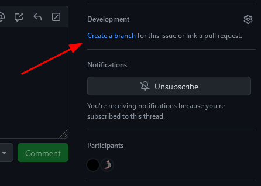
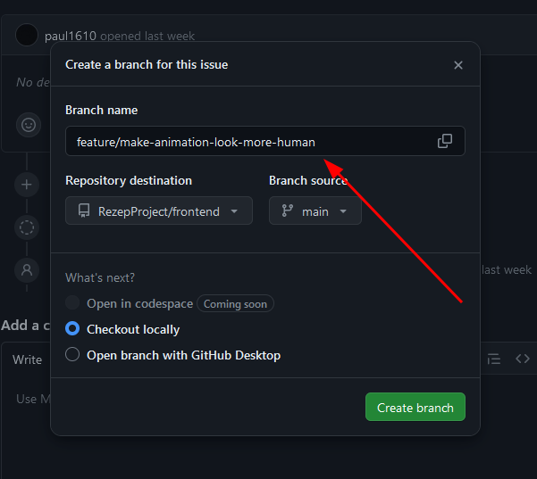

## Branching Ruleset

1. **Branches Origin**: Branches should only be created from tasks or user stories in our GitHub Kanban board to ensure alignment with project objectives and priorities.

   

2. **Use Descriptive Names**: Name branches clearly and descriptively, indicating their purpose or feature.

3. **Prefix Convention**: Utilize prefixes like "feature/" for new features and "bug/" for bug fixes to categorize branches by type. For example, a branch implementing user authentication could be named `feature/user-authentication`.

   Other examples:  
   `feature/add-user-authentication`  
   `fix/bug-in-payment-processing`  
   `refactor/update-database-schema`  

   

4. **Limit Branch Lifespan**: Delete branches once merged or no longer needed to avoid clutter.

5. **Branch from Up-to-Date Main**: Always create branches from an updated main branch to prevent conflicts and ensure your changes are based on the latest codebase.

6. **Small, Atomic Commits**: Make small, atomic commits representing a single logical change to aid in understanding and reviewing.

7. **Code Review Before Merge**: All changes must undergo code review before merging into the main branch to maintain quality and consistency. Fabian Baitura will mainly review it, with Paul Nell and Jonas Pamminger also involved in the review process, especially if Fabian is unavailable.

8. **Review Timeline and Contingency**: Pull requests should be submitted at least 2 days before the sprint deadline to allow time for review and potential revisions. If a pull request is submitted after the 2-day deadline, it will not be merged or reviewed until the next sprint.
